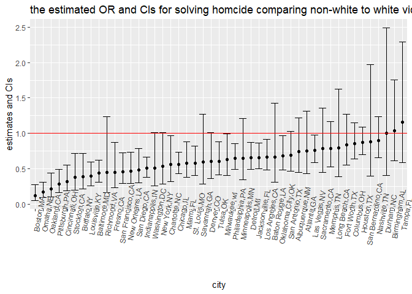
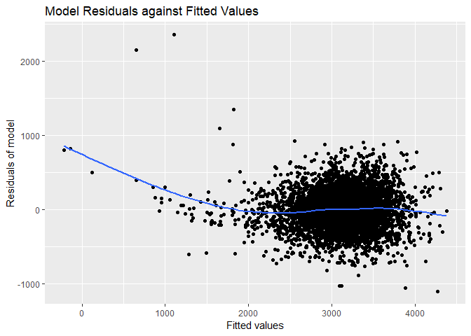
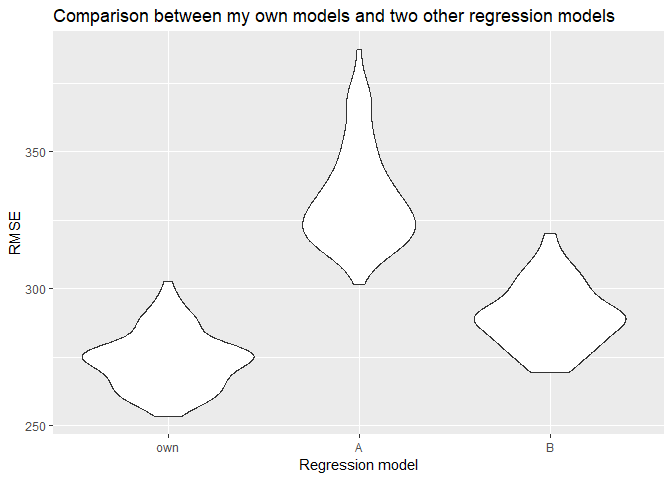

P8105\_hw6
================
Jingyu Xu
2018/11/22

Problem 1
=========

``` r
library(tidyverse)
set.seed(1)
homcide = read_csv( file = "./data/homicide-data.csv")
```

### data cleaning

A code chunk below is used to clean the data: 1)Create a city\_state variable (e.g. “Baltimore, MD”) and a binary variable indicating whether the homicide is solved. 2)Omit cities Dallas, TX; Phoenix, AZ; and Kansas City, MO – these don’t report victim race. omit Tulsa, AL – this is a data entry mistake. 3)Modifiy victim\_race to have categories white and non-white, with white as the reference category. Make sure that victim\_age is numeric.

``` r
homcide = homcide %>%
  janitor::clean_names() %>%
  mutate(city_state = str_c(city, ",", state)) %>%
  subset(!city_state %in% c("Dallas,TX","Phoenix,AZ","Kansas City,MO","Tulsa,AL")) %>%
  mutate(victim_race = ifelse(victim_race != "White", "non-white", "white")) %>%
  mutate(victim_age = as.numeric(victim_age), victim_race = fct_relevel(victim_race, "white"))
```

### Baltimore Division

For the city of Baltimore, MD, a code chunk is used to utilize the glm function to fit a logistic regression with resolved vs unresolved as the outcome and victim age, sex and race (as just defined) as predictors.

``` r
Baltimore = filter(homcide, city_state == "Baltimore,MD") %>%
mutate(resolved = as.numeric(disposition == "Closed by arrest")) %>%
select(resolved, victim_age, victim_race, victim_sex)

fit_logistic = 
  Baltimore %>% 
  glm(resolved ~ victim_age + victim_race + victim_sex, data = ., family = binomial()) %>%
  broom::tidy(conf.int = TRUE) %>%
  mutate(OR = exp(estimate), conf.low = exp(conf.low), conf.high = exp(conf.high))     %>%
  filter(term == "victim_racenon-white") %>%
  select(term,OR, conf.low,conf.high)

knitr::kable(fit_logistic)
```

| term                  |        OR|   conf.low|  conf.high|
|:----------------------|---------:|----------:|----------:|
| victim\_racenon-white |  0.440608|  0.3121625|  0.6196693|

Thus, keeping all other variables fixed, the estimate of the adjusted odds ratio for solving homicides comparing non-white victims to white victims is 0.440608. And we are 95% confident that the estimate fall into (0.3121625, 0.6196693)

### glm for all the cities in the dataset

Now, a code chunk is used to run glm for each of the cities in the dataset, and extract the adjusted odds ratio (and CI) for solving homicides comparing non-white victims to white victims.

``` r
##exclude more city with unknown victim-race
homcide1 = homcide %>%
  filter(victim_race != "unknown") %>%
  mutate(resolved = as.numeric(disposition == "Closed by arrest"))

nest_lm_res =
  homcide1 %>% 
  group_by(city_state) %>% 
  nest() %>% 
  mutate(models = map(data, ~glm(resolved ~ victim_age + victim_race + victim_sex, data = .x, family = binomial())),
  models = map(models, broom::tidy)) %>% 
  select(-data) %>% 
  unnest() %>%
  mutate(OR = exp(estimate), conf.low = exp(estimate - qnorm(0.975)*std.error), conf.high = exp(estimate + qnorm(0.975)*std.error)) %>%
  filter(term == "victim_racenon-white") %>%
  select(city_state,term,OR, conf.low,conf.high)
```

Then, a code chunk is used to create a plot that shows the estimated ORs and CIs for each city. Organize cities according to estimated OR, and comment on the plot.

``` r
nest_lm_res %>%
mutate(city_state = fct_reorder(city_state, OR)) %>%
ggplot(aes(x = city_state, y = OR)) +
geom_point() +
geom_errorbar(aes(ymin = conf.low, ymax = conf.high)) +
geom_hline(yintercept = 1.0, color = "red") +
theme(axis.text.x =  element_text(angle = 80)) +
labs(
title = "the estimated OR and CIs for solving homcide comparing non-white to white victims across the U.S.",
x = "city",
y = "estimates and CIs"
)
```



In the graph, I use odds ratio = 1.0 as a cut-off line. We can observe that there are only three cities (Durham, NC; Birmingham, AL; Tampa, FL) which have the estimated odds ratio over 1.0, indicating that the odds of solving non-white victims is larger than the odds of solving white victims. Also, we can observe that Boston has the least odds ratio.

Problem 2
=========

### data cleaning

Firstly, a code chunk is used to load and clean the data for regression analysis: 1)convert some variables to factor, based on the meaning in the real application. 2)use summary function to see whether there are "unknown" observation. 3)use sum(is.na()) to check whether there are missing data.

``` r
birthweight = read_csv("./data/birthweight.csv") %>% 
  janitor::clean_names() %>% 
  mutate(
    babysex = as.factor(babysex), 
    frace = as.factor(frace), 
    malform = as.factor(malform), 
    mrace = as.factor(mrace))
# check for unknown observation
summary(birthweight)
```

    ##  babysex      bhead          blength           bwt           delwt      
    ##  1:2230   Min.   :21.00   Min.   :20.00   Min.   : 595   Min.   : 86.0  
    ##  2:2112   1st Qu.:33.00   1st Qu.:48.00   1st Qu.:2807   1st Qu.:131.0  
    ##           Median :34.00   Median :50.00   Median :3132   Median :143.0  
    ##           Mean   :33.65   Mean   :49.75   Mean   :3114   Mean   :145.6  
    ##           3rd Qu.:35.00   3rd Qu.:51.00   3rd Qu.:3459   3rd Qu.:157.0  
    ##           Max.   :41.00   Max.   :63.00   Max.   :4791   Max.   :334.0  
    ##     fincome      frace       gaweeks      malform     menarche    
    ##  Min.   : 0.00   1:2123   Min.   :17.70   0:4327   Min.   : 0.00  
    ##  1st Qu.:25.00   2:1911   1st Qu.:38.30   1:  15   1st Qu.:12.00  
    ##  Median :35.00   3:  46   Median :39.90            Median :12.00  
    ##  Mean   :44.11   4: 248   Mean   :39.43            Mean   :12.51  
    ##  3rd Qu.:65.00   8:  14   3rd Qu.:41.10            3rd Qu.:13.00  
    ##  Max.   :96.00            Max.   :51.30            Max.   :19.00  
    ##     mheight          momage     mrace        parity            pnumlbw 
    ##  Min.   :48.00   Min.   :12.0   1:2147   Min.   :0.000000   Min.   :0  
    ##  1st Qu.:62.00   1st Qu.:18.0   2:1909   1st Qu.:0.000000   1st Qu.:0  
    ##  Median :63.00   Median :20.0   3:  43   Median :0.000000   Median :0  
    ##  Mean   :63.49   Mean   :20.3   4: 243   Mean   :0.002303   Mean   :0  
    ##  3rd Qu.:65.00   3rd Qu.:22.0            3rd Qu.:0.000000   3rd Qu.:0  
    ##  Max.   :77.00   Max.   :44.0            Max.   :6.000000   Max.   :0  
    ##     pnumsga      ppbmi            ppwt           smoken      
    ##  Min.   :0   Min.   :13.07   Min.   : 70.0   Min.   : 0.000  
    ##  1st Qu.:0   1st Qu.:19.53   1st Qu.:110.0   1st Qu.: 0.000  
    ##  Median :0   Median :21.03   Median :120.0   Median : 0.000  
    ##  Mean   :0   Mean   :21.57   Mean   :123.5   Mean   : 4.145  
    ##  3rd Qu.:0   3rd Qu.:22.91   3rd Qu.:134.0   3rd Qu.: 5.000  
    ##  Max.   :0   Max.   :46.10   Max.   :287.0   Max.   :60.000  
    ##      wtgain      
    ##  Min.   :-46.00  
    ##  1st Qu.: 15.00  
    ##  Median : 22.00  
    ##  Mean   : 22.08  
    ##  3rd Qu.: 28.00  
    ##  Max.   : 89.00

``` r
#check for missing data
sum(is.na(birthweight))
```

    ## [1] 0

We can see that there is no missing data in the dataset.

### construct own regression model

I use stepwise regression to construct the multiple linear regression models for birthweight.

``` r
mlr = lm(bwt ~ ., data = birthweight)
step(mlr, direction = 'both')
```

    ## Start:  AIC=48717.83
    ## bwt ~ babysex + bhead + blength + delwt + fincome + frace + gaweeks + 
    ##     malform + menarche + mheight + momage + mrace + parity + 
    ##     pnumlbw + pnumsga + ppbmi + ppwt + smoken + wtgain
    ## 
    ## 
    ## Step:  AIC=48717.83
    ## bwt ~ babysex + bhead + blength + delwt + fincome + frace + gaweeks + 
    ##     malform + menarche + mheight + momage + mrace + parity + 
    ##     pnumlbw + pnumsga + ppbmi + ppwt + smoken
    ## 
    ## 
    ## Step:  AIC=48717.83
    ## bwt ~ babysex + bhead + blength + delwt + fincome + frace + gaweeks + 
    ##     malform + menarche + mheight + momage + mrace + parity + 
    ##     pnumlbw + ppbmi + ppwt + smoken
    ## 
    ## 
    ## Step:  AIC=48717.83
    ## bwt ~ babysex + bhead + blength + delwt + fincome + frace + gaweeks + 
    ##     malform + menarche + mheight + momage + mrace + parity + 
    ##     ppbmi + ppwt + smoken
    ## 
    ##            Df Sum of Sq       RSS   AIC
    ## - frace     4    124365 320848704 48712
    ## - malform   1      1419 320725757 48716
    ## - ppbmi     1      6346 320730684 48716
    ## - momage    1     28661 320752999 48716
    ## - mheight   1     66886 320791224 48717
    ## - menarche  1    111679 320836018 48717
    ## - ppwt      1    131132 320855470 48718
    ## <none>                  320724338 48718
    ## - fincome   1    193454 320917792 48718
    ## - parity    1    413584 321137922 48721
    ## - mrace     3    868321 321592659 48724
    ## - babysex   1    853796 321578134 48727
    ## - gaweeks   1   4611823 325336161 48778
    ## - smoken    1   5076393 325800732 48784
    ## - delwt     1   8008891 328733230 48823
    ## - blength   1 102050296 422774634 49915
    ## - bhead     1 106535716 427260054 49961
    ## 
    ## Step:  AIC=48711.51
    ## bwt ~ babysex + bhead + blength + delwt + fincome + gaweeks + 
    ##     malform + menarche + mheight + momage + mrace + parity + 
    ##     ppbmi + ppwt + smoken
    ## 
    ##            Df Sum of Sq       RSS   AIC
    ## - malform   1      1447 320850151 48710
    ## - ppbmi     1      6975 320855679 48710
    ## - momage    1     28379 320877083 48710
    ## - mheight   1     69502 320918206 48710
    ## - menarche  1    115708 320964411 48711
    ## - ppwt      1    133961 320982665 48711
    ## <none>                  320848704 48712
    ## - fincome   1    194405 321043108 48712
    ## - parity    1    414687 321263390 48715
    ## + frace     4    124365 320724338 48718
    ## - babysex   1    852133 321700837 48721
    ## - gaweeks   1   4625208 325473911 48772
    ## - smoken    1   5036389 325885093 48777
    ## - delwt     1   8013099 328861802 48817
    ## - mrace     3  13540415 334389119 48885
    ## - blength   1 101995688 422844392 49908
    ## - bhead     1 106662962 427511666 49956
    ## 
    ## Step:  AIC=48709.53
    ## bwt ~ babysex + bhead + blength + delwt + fincome + gaweeks + 
    ##     menarche + mheight + momage + mrace + parity + ppbmi + ppwt + 
    ##     smoken
    ## 
    ##            Df Sum of Sq       RSS   AIC
    ## - ppbmi     1      6928 320857079 48708
    ## - momage    1     28660 320878811 48708
    ## - mheight   1     69320 320919470 48708
    ## - menarche  1    116027 320966177 48709
    ## - ppwt      1    133894 320984044 48709
    ## <none>                  320850151 48710
    ## - fincome   1    193784 321043934 48710
    ## + malform   1      1447 320848704 48712
    ## - parity    1    414482 321264633 48713
    ## + frace     4    124393 320725757 48716
    ## - babysex   1    851279 321701430 48719
    ## - gaweeks   1   4624003 325474154 48770
    ## - smoken    1   5035195 325885346 48775
    ## - delwt     1   8029079 328879230 48815
    ## - mrace     3  13553320 334403471 48883
    ## - blength   1 102009225 422859375 49906
    ## - bhead     1 106675331 427525481 49954
    ## 
    ## Step:  AIC=48707.63
    ## bwt ~ babysex + bhead + blength + delwt + fincome + gaweeks + 
    ##     menarche + mheight + momage + mrace + parity + ppwt + smoken
    ## 
    ##            Df Sum of Sq       RSS   AIC
    ## - momage    1     29211 320886290 48706
    ## - menarche  1    117635 320974714 48707
    ## <none>                  320857079 48708
    ## - fincome   1    195199 321052278 48708
    ## + ppbmi     1      6928 320850151 48710
    ## + malform   1      1400 320855679 48710
    ## - parity    1    412984 321270064 48711
    ## + frace     4    125020 320732060 48714
    ## - babysex   1    850020 321707099 48717
    ## - mheight   1   1078673 321935752 48720
    ## - ppwt      1   2934023 323791103 48745
    ## - gaweeks   1   4621504 325478583 48768
    ## - smoken    1   5039368 325896447 48773
    ## - delwt     1   8024939 328882018 48813
    ## - mrace     3  13551444 334408523 48881
    ## - blength   1 102018559 422875638 49904
    ## - bhead     1 106821342 427678421 49953
    ## 
    ## Step:  AIC=48706.02
    ## bwt ~ babysex + bhead + blength + delwt + fincome + gaweeks + 
    ##     menarche + mheight + mrace + parity + ppwt + smoken
    ## 
    ##            Df Sum of Sq       RSS   AIC
    ## - menarche  1    100121 320986412 48705
    ## <none>                  320886290 48706
    ## - fincome   1    240800 321127090 48707
    ## + momage    1     29211 320857079 48708
    ## + ppbmi     1      7479 320878811 48708
    ## + malform   1      1678 320884612 48708
    ## - parity    1    431433 321317724 48710
    ## + frace     4    124743 320761547 48712
    ## - babysex   1    841278 321727568 48715
    ## - mheight   1   1076739 321963029 48719
    ## - ppwt      1   2913653 323799943 48743
    ## - gaweeks   1   4676469 325562760 48767
    ## - smoken    1   5045104 325931394 48772
    ## - delwt     1   8000672 328886962 48811
    ## - mrace     3  14667730 335554021 48894
    ## - blength   1 101990556 422876847 49902
    ## - bhead     1 106864308 427750598 49952
    ## 
    ## Step:  AIC=48705.38
    ## bwt ~ babysex + bhead + blength + delwt + fincome + gaweeks + 
    ##     mheight + mrace + parity + ppwt + smoken
    ## 
    ##            Df Sum of Sq       RSS   AIC
    ## <none>                  320986412 48705
    ## + menarche  1    100121 320886290 48706
    ## - fincome   1    245637 321232048 48707
    ## + momage    1     11698 320974714 48707
    ## + ppbmi     1      8823 320977589 48707
    ## + malform   1      1884 320984528 48707
    ## - parity    1    422770 321409181 48709
    ## + frace     4    128726 320857686 48712
    ## - babysex   1    846134 321832545 48715
    ## - mheight   1   1012240 321998651 48717
    ## - ppwt      1   2907049 323893461 48743
    ## - gaweeks   1   4662501 325648912 48766
    ## - smoken    1   5073849 326060260 48771
    ## - delwt     1   8137459 329123871 48812
    ## - mrace     3  14683609 335670021 48894
    ## - blength   1 102191779 423178191 49903
    ## - bhead     1 106779754 427766166 49950

    ## 
    ## Call:
    ## lm(formula = bwt ~ babysex + bhead + blength + delwt + fincome + 
    ##     gaweeks + mheight + mrace + parity + ppwt + smoken, data = birthweight)
    ## 
    ## Coefficients:
    ## (Intercept)     babysex2        bhead      blength        delwt  
    ##   -6098.822       28.558      130.777       74.947        4.107  
    ##     fincome      gaweeks      mheight       mrace2       mrace3  
    ##       0.318       11.592        6.594     -138.792      -74.887  
    ##      mrace4       parity         ppwt       smoken  
    ##    -100.678       96.305       -2.676       -4.843

After the stepwise procedure, we get a optimal(not globle) model based on the selection rule.(bwt ~ babysex + bhead + blength + delwt + fincome + gaweeks + mheight + mrace + parity + ppwt + smoken). So I Save the output of final glm as an R object

``` r
mlr_own = lm( bwt ~ babysex + bhead + blength + delwt + fincome + 
    gaweeks + mheight + mrace + parity + ppwt + smoken, data = birthweight)
```

### show a plot of model residuals against fitted values

``` r
library(modelr)
birthweight %>% 
  add_predictions(mlr_own) %>% 
  add_residuals(mlr_own) %>% 
  ggplot(aes(x = pred, y = resid)) + 
  geom_point() + 
  geom_smooth(se = FALSE) + 
  labs(title = "Model Residuals against Fitted Values",
        x = "Fitted values",
        y = "Residuals of model")
```



From the graph, We observe that when the predictions are bewteen 2000 and 4000, the residuals are almost evenly settled around zero. However, when the fitted values are in the other intervals, the trend of distribution is quite different from that of \[2000,4000\] and is not evenly distributed. So we can conclude that this model doesn't fit when the predicted value is less than 2000 or larger than 4000.

### compare own models to two other models

Now, compare my own model to two others: 1)I denote the own model as model\_own 2)Construct one using length at birth and gestational age as predictors (main effects only) and denote it as model\_A 3)Construct One using head circumference, length, sex, and all interactions (including the three-way interaction) between these and denote it as model\_B

``` r
#construct cross-validation 
cv_df = 
  crossv_mc(birthweight, 100) %>%
  mutate(train = map(train, as_tibble),
         test = map(test, as_tibble)) %>% 
  mutate(model_own = map(train, ~lm(bwt ~  babysex + bhead + blength + delwt + fincome + 
    gaweeks + mheight + mrace + parity + ppwt + smoken, data = .x)),
         model_A = map(train, ~lm(bwt ~ blength + gaweeks, data = .x)),
         model_B = map(train, ~lm(bwt ~ (bhead + blength + babysex)^3, data = .x)),
         rmse_own = map2_dbl(model_own, test, ~rmse(model = .x, data = .y)),
         rmse_A = map2_dbl(model_A, test, ~rmse(model = .x, data = .y)),
         rmse_B = map2_dbl(model_B, test, ~rmse(model = .x, data = .y)))
```

A code chunk is used to show a violin plot in terms of the cross-validated prediction error(RMSE), comparing my own models with two others.

``` r
cv_df %>% 
  select(starts_with("rmse")) %>% 
  gather(key = model, value = rmse) %>% 
  mutate(model = str_replace(model, "rmse_", ""),
         model = fct_inorder(model)) %>% 
  ggplot(aes(x = model, y = rmse)) + 
  geom_violin() +
  labs(title = "Comparison between my own models and two other regression models",
        x = "Regression model",
        y = "RMSE")
```



From the plot, we observe that my own model(using stepwise) has the least RMSE, which means that it has good prediction ability. And the model using length at birth and gestational age as predictors (main effects only) has the highest RMSE. However, we have to notice that the model using head circumference, length, sex, and all interactions (including the three-way interaction) also has a low RMSE, which is slightly higher than our own model. In the further construction of our regression model, we may consider exploring the influence of interaction between variables.
